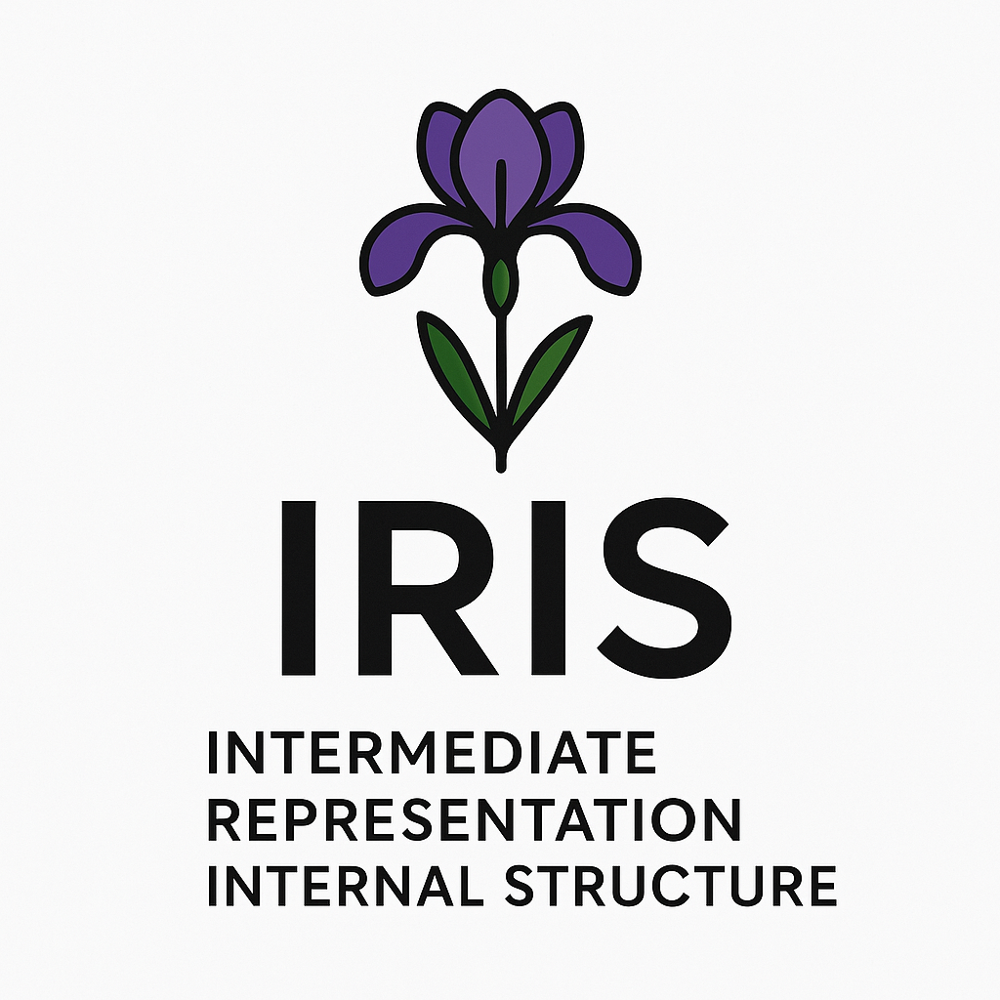

# iris
Intermediate Representation Internal Structure - SSA-like IR developed as an educational project



#### Overview

IRIS is an example of IR that includes simple operations, separated into different _dialects_ - _arith_, _builtin_ and _ctrlflow_.

Dialect _arith_:
- _ADD_, _SUB_, _MUL_, _DIV_ - basic arithmetical operations;
- _CONST_ - operation generating a constant SSA value;
- _CAST_ - operation, casting values between different data types;
- _CMP_ - comparison operation, which takes predicate (``EQ`` (equal), ``NEQ`` (not-equal), ``A`` (above), ``B`` (below), ``AE`` (above or equal), ``BE`` (below or equal)).

Dialect _builtin_:
- _PARAM_ - operation representing function's parameter;
- _COPY_ - operation that copies one SSA value into the new one.
    
Dialect _ctrlflow_:
- _CALL_ - routine call operation;
- _JUMP_ - unconditional jump;
- _JUMPC_ - conditional jump;
- _RETURN_ - return from the routine operation;
- _PHI_ - phi-function.

#### IRIS structure & examples

Here's an example of IRIS IR for a programm that calculates factorial of a number:
```text
factorial:
  ^bb0 <start> <to bb1> :
      a0.ui32 builtin.param -> (v3,v5,v7)
      c1.ui32 arith.const (1) -> (v5,v8p)
      c2.ui32 arith.const (2) -> (v3)
  ^bb1 <from bb0> <to T:bb2 / F:bb3> :
      v3.b arith.cmp.b (a0 : ui32, c2 : ui32) -> (n4)
      n4 ctrlflow.jmpc (v3 : b)
  ^bb3 <from bb1> <to bb2> :
      v5.ui32 arith.sub (a0 : ui32, c1 : ui32) -> (v6)
      v6.ui32 ctrlflow.call @factorial (v5 : ui32) -> (v7)
      v7.ui32 arith.mul (a0 : ui32, v6 : ui32) -> (v8p)
  ^bb2 <from bb3 bb1> <final> :
      v8p.ui32 ctrlflow.phi (c1 : ui32, v7 : ui32) -> (n9)
      n9 ctrlflow.return (v8p : ui32)
```

Each **operation** is located in one of the **basic blocks**, and basic block is located in the **region**, which represent IR for a whole routine (function).

Function parameters are marked with literal ``a`` (``a0``, ``a1`` etc.).
Constant-generated SSA values are marked with literal ``c`` (``c1``, ``c2`` etc.).
Other SSA values are marked with literal ``v`` (``v3``, ``v4`` etc.).

Operations that do not produce material result, for example, _ctrlflow::jump_, are marked with literal ``n`` for 'none', as its return value type is ``DataType::NONE``.

Notice that different SSA values can have different literal preceeding its ID, but regardless of the literal **every value in the region has unique ID**.

Basic block properties:
- Basic block's ID is unique among the others in the same region;
- Each basic block has a list of **predecessors** (``<from bb3 bb1>``), or it is the starting basic block, in which case it is marked with ``<start>``;
- A basic block can have either zero (``<final>``), one (``<to bb2>``) or two **successors** (``<to T:bb2 / F:bb3>``);
- Basic block cannot have a **terminator** operation inside of it (it must be the last operation in the basic block);
- If operation have zero successors, its last operation must be _ctrlflow::return_ (TODO - add check);
- If operation have one successor, its last operation cannot be _ctrlflow::jumpc_;
- If operation have two successors, its last operation must be _ctrlflow::jumpc_.

Operations common properties:
- **Opcode** value, which is unique for every type of operation across all dialects;
- **SSA-value's ID**, which is unique across whole region;
- **Return data type**, which is ``DataType::NONE`` if operation does not produce any result;
- Optional list of **inputs**. Some operations can have variadic number of inputs (_ctrlflow::call_), other have fixed number of inputs (_arith::add_);
- List of **users**, who use this operation's result as their input/inputs;

``iris::Region`` class provide API for working with basic block's dominators:
- ``collectDomInfo()`` - collect dominators information from the graph;
- ``getDFS()`` and ``getRPO()`` - obtain corresponding traversal orders;
- ``getIdom()`` and ``getIdomByID()`` - get immediate dominator
- ``getDominatedBlocks()`` and ``getDominatedBlocksByID()`` - get blocks, for which given one is immediate dominator;
- ``getDominatorsChain()`` and ``getDominatorsChainByID()`` - get chain of immediate dominators from the given block to the starting block.

#### Building examples

Requirements:
- _CMake_ >= 3.21
- _C++_ compiler supporting **C++23** standard

To build project, use following commads from the project's roor directory:
```text
cmake -B build
cmake --build build
```

If you want to build specific target, use following command:
```text
cmake --build build --target <target_name>
```

List of available targets:
- ``iris`` - IR-support static library
- ``factorial`` - example of IR usage - building IR for a programm calculating factorial manually via ``iris::IRBuilder``

Static library output files are located in ``build/lib/``, and executables - in ``build/bin``.

#### Testing

Project includes tests, impemented using **GTest**.

To build and run tests, run following commands from project's root directory:
```text
cmake -B build
cmake --build build --target iris_tests
cd build
ctest
```

Tests include:
- Separate test suites for each dialect and its operations' verifiers and construction pre-conditions (``tests/dialects/``);
- Tests of verifiers (ex-fails) and API tests for:
    - Generic operation ``iris::Operation``;
    - Basic block ``iris::BasicBlock``;
    - Region ``iris::Region`` (WIP);
    - IR-builder ``iris::IRBuilder`` (WIP);
- Immediate dominators calculation tests (``tests/doms.cpp``);
